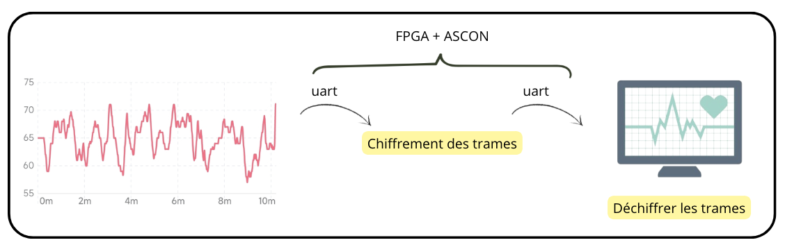
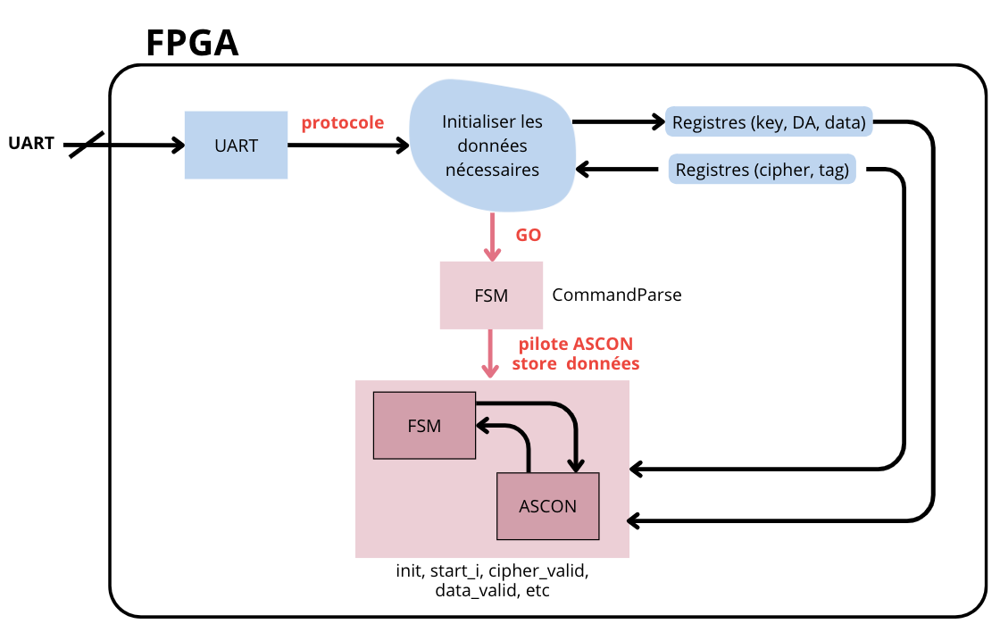
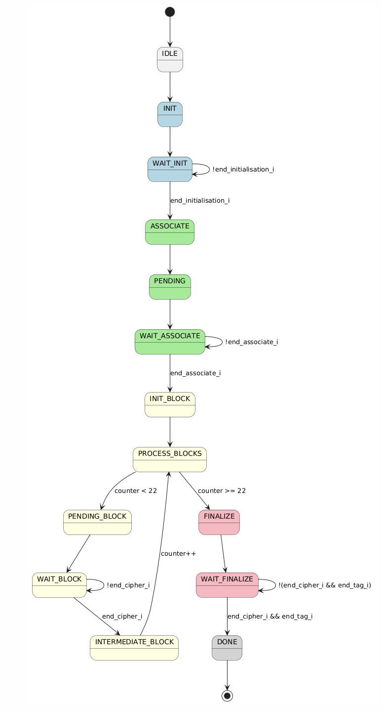

# FPGA_ECG

__auteurs__ : Bilel Betka et Chloé Larroze

## Introduction

Ce projet se divisera en deux parties :

1. **Chiffrement en matériel** : Implémentation du protocole ASCON128 sur une carte FPGA Pynq, sous Vivado.
2. **Déchiffrement en logiciel** : Pilotage d'ASCON avec des données simulées d'un ECG.



---

## 1. Fichiers et fonctionnement

todo

---

## 2. Partie FPGA : Chiffrement des données ECG

Le chiffrement est basé sur une première machine d'état qui pilote une FSM dédiée au protocole ASCON (bloc rouge dans le schéma ci-dessous). Son fonctionnement est similaire à celui rencontré l'an passé dans la mesure où l'algorithme fonctionne en trois étapes principales : l'initialisation avec une clé et un nonce, l’absorption des données associées et du texte clair via des permutations successives, puis la finalisation qui génère à la fois le texte chiffré et un tag d’authentification pour vérifier l’intégrité des données.

### Paramètres pricipaux d'Ascon 128 :

- **Clé** : 128 bits
- **Nonce** : 128 bits
- **Texte clair (Plain text)** : 64 bits
- **Données** : 161 x 8 bits
- **Donnée associée (DA)** : 64 bits



Nous avons à notre disposition le module `ascon.sv` pour lequel nous avons développé un **testbench** afin de valider son bon fonctionnement. Le chiffrement suit les étapes suivantes :
1. **Initialisation**
2. **Traitement des données associées**
3. **Chiffrement des données ECG**
4. **Finalisation**

### Explication des entrées/sorties :
**Entrées :**
- `associated_data` : Indique si la donnée est associée (`1'b1`) ou du texte clair (`1'b0`).
- `finalisation` : Indique la fin du chiffrement (`1'b1` lorsque le texte clair et le tag sont terminés).

**Sorties :**
- `end_associate` : Indique la fin du calcul de permutation `p^6`.
- `cipher_valid` : Indique que le texte chiffré est disponible.
- `end_tag_o` : Similaire à `cipher_valid`, indique que le tag est prêt.
- `end_init_o` : Signale la fin de l'initialisation.

Le test commence par l'initialisation du module avec une clé et un nonce prédéfinis. Ensuite, une donnée associée de 48 bits, complétée par un padding de 16 bits, est injectée dans l'algorithme. Une fois l'association terminée, les blocs de données ECG sont chiffrés un par un, lorsque la sortie du chiffrement est valide. Les 24 derniers bits manquants sont traités à la fin avec l’indicateur de finalisation activé. Après un délai suffisant pour la génération du tag d’authentification, les on affiche les résultats.
  


### FSM de contrôle d'ASCON

Une FSM contrôle le fonctionnement global du chiffrement. Elle est basée sur le testbench et suit l'algorigramme suivant :



> **Note** : La logique combinatoire et séquentielle n'est pas séparée dans le code, ce qui ne respecte pas strictement les normes FPGA. Pour éviter d'alourdir le code, nous avons utilisé une assignation par défaut de l'état :>

```systemverilog
// Logique combinatoire
always_comb begin
    etat_f = etat_p; // Reste dans l'état présent par défaut 
```

Nous validons ensuite la FSM avec un testbench (`fsm_ascon_tb.sv`), en comparant les chronogrammes obtenus, les chronogrammes du test bench doivent être identiques aux premiers.

---

## Ajout du module UART

L'intégration du module UART permet la communication avec la carte. Il est inclus dans `inter_spartan`, et une FSM `fsm_uart.sv` gère l'échange de commandes. Nous complèterons donc ces deux modules. 

### Les commandes gérées :
On va avoir besoin de définir de nouveaux états dans l’instance pour gérer les commandes qui seront envoyées (pour l’instant une seule, le K, le N et le G. On devra rajouter les autres)  : 
- **K** : Définition de la clé (128 bits)  
- **A** : Donnée associée  
- **N** : Définition du nonce  
- **W** : Données ECG  
- **G** : Chiffrement ASCON  
- **C** : Envoi du texte chiffré  
- **T** : Récupération du tag  

### Registres gérés par la FSM :
- `wave_reg`  
- `cipher_reg`  
- `ascon_reg`  

La FSM contrôle l'envoi du texte chiffré, octet par octet. Par ailleurs, du coté de la FSM ascon que nous venons de développer, il faut créer une nouvelle input que l’on relie à Go_s en sortie de la FSM Uart ainsi qu’un signal d’enable que nous passerons à l’état haut à chaque fois que le cipher est valide, afin d’activer l’envoi vers notre registre.  
On a le schéma complet de la `fsm_uart` suivant : 


